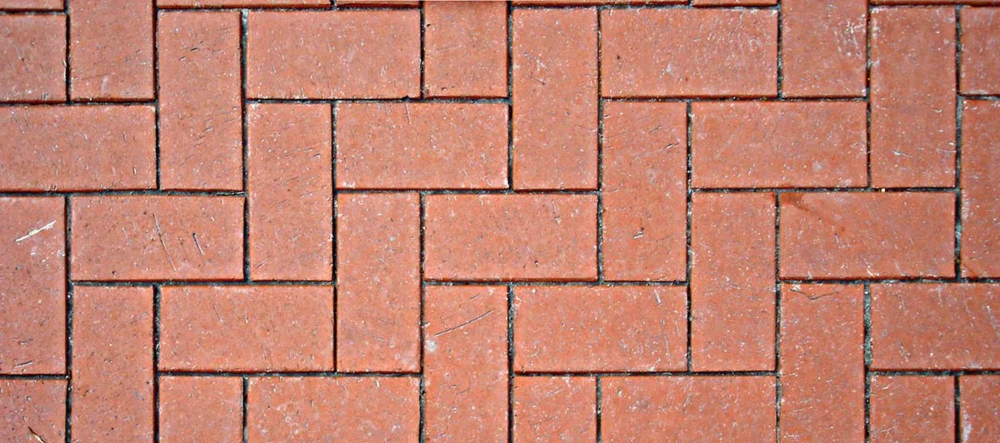
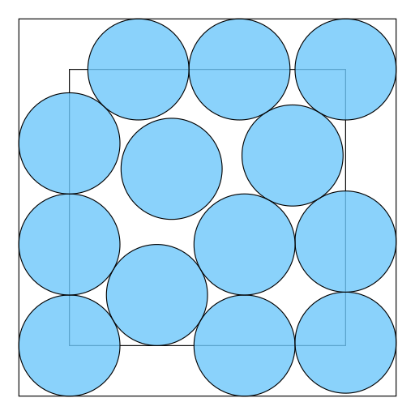

# La courbe du Dragon - Quelques propriétés en vidéo

## La courbe du dragon est une fractale

Une fractale est un contour identique que l'on retrouve à différentes échelles.

C'est comme si on regardait un objet au microscope agrandit 100 fois et qu'on retrouvait la forme de cet objet. Puis on agrandit à nouveau 1000 fois, et on voit à nouveau cette forme, et ainsi de suite à l'infini !

Par exemple, je regarde une fourmi au microscope et je constate que son contour est composé de plein de formes de fourmis, alors je décide d'en cibler une et de l'agrandir, et je constate que c'est pareil, et que ça se reproduit à l'infini.

Dans la nature, les choux romanesco, les vaissaux sanguins, certaines fougères, etc. ont des formes fractales (mais finies).

Voici un exemple avec la forme naturelle d'une fougère :

 
By Andrew Holm  Posted 9th January 2017  In Business, Fractal Model

Notre courbe du dragon est une fractale.

Si on zoome ou qu'on dézoome dans la courbe du Dragon, on voit les mêmes formes revenir. Voici un exemple avec une courbe du dragon de niveau 41 :

https://www.youtube.com/watch?v=J7IKKzzApg8

([Dropbox mov](https://www.dropbox.com/s/moann1cfdmop1v4/La%20fourmi%20de%20Langton%20-%20Science%20%C3%A9tonnante%20%2321.mov?dl=0))

([Dropbox mp4](https://www.dropbox.com/s/4harhnzpahpch1c/41%20Iteration%20Dragon%20Curve%20Zoom%20Test.mp4?dl=0))

  

## La courbe du dragon pave le plan

Une forme qui pave le plan est une forme unique qu'on peut utiliser pour recouvrir complètement une surface aussi grande qu'on veut.

Par exemple, les rectangles pavent le plan :

 

Mais pas les cercles :

 
 

Notre courbe du dragon permet de paver le plan !

Voici une vidéo qui le montre :

https://www.youtube.com/watch?v=-sad-hmgZIs

([Dropbox mov](https://www.dropbox.com/s/moann1cfdmop1v4/La%20fourmi%20de%20Langton%20-%20Science%20%C3%A9tonnante%20%2321.mov?dl=0))

([Dropbox mp4](https://www.dropbox.com/s/18halpu4439yv4p/La%20fourmi%20de%20Langton%20-%20Science%20%C3%A9tonnante%20%2321.mp4?dl=0))

NB: On peut également voir dans cette vidéo qu'on utilise une autre méthode (plus géométrique) pour construire la courbe.
